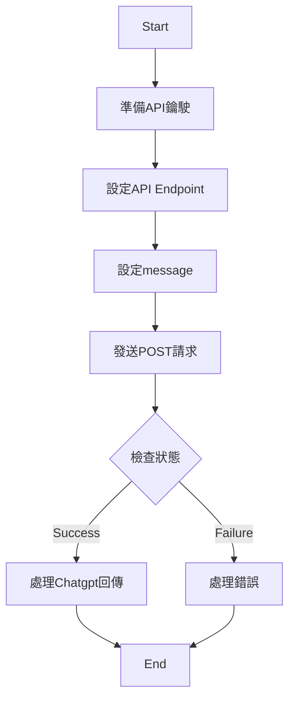

# Java_LLM_lesson--1
 a series of teaching lesson how to use java combine with AIGC


Request Method
```
curl https://api.openai.com/v1/chat/completions \
  -H "Content-Type: application/json" \
  -H "Authorization: Bearer $OPENAI_API_KEY" \
  -d '{
     "model": "gpt-4o-mini",
     "messages": [{"role": "user", "content": "Say this is a test!"}],
     "temperature": 0.7
   }'
```
his request queries the gpt-4o-mini model (which under the hood points to a gpt-4o-mini model variant) to complete the text starting with a prompt of "Say this is a test". You should get a response back that resembles the following:
```
{
    "id": "chatcmpl-abc123",
    "object": "chat.completion",
    "created": 1677858242,
    "model": "gpt-4o-mini",
    "usage": {
        "prompt_tokens": 13,
        "completion_tokens": 7,
        "total_tokens": 20
    },
    "choices": [
        {
            "message": {
                "role": "assistant",
                "content": "\n\nThis is a test!"
            },
            "logprobs": null,
            "finish_reason": "stop",
            "index": 0
        }
    ]
}
```
